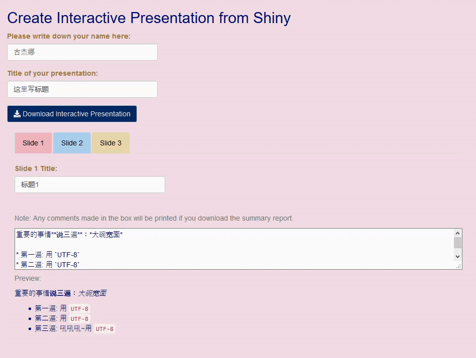

# Shiny_Interactive_Presentation
Unlock the shiny possibilities of supporting foreign languages and unite #rstats from all over the world together!

Live demo: https://appforiarteam.shinyapps.io/D3_folded_bar_presentation/ 

* Interactive Presentation with multi-language: you can write down your name and write down some notes for your presentation (support foreign language), then click download interactive presentation
* Interact with D3 plot: You can select any bar you want by clicking bar chart or the dropdown menu on the left
